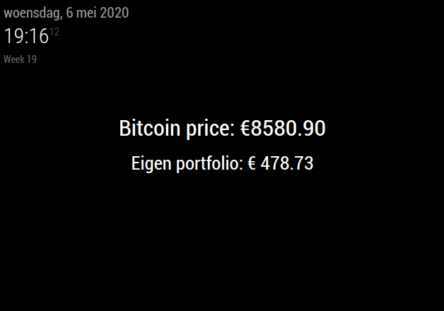

# MMM-bitcoin-portfolio
A Bitcoin pricechecker which can also display the price of your Bitcoin amount.
Module for <a href="https://github.com/MichMich/MagicMirror">MagicMirror</a>.

## Support
If you like this module and want to thank, please buy me a coffee.

<a href="https://www.buymeacoffee.com/jeroenpeters" target="_blank"></a>

## Preview


## Installation

In your terminal, go to your MagicMirror's Module folder:
````
cd ~/MagicMirror/modules
````

Clone this repository:
````
git clone https://github.com/jeroenpeters1986/MMM-bitcoin-portfolio.git
````

Now get your SolarEdge API key and authorize your application (instructions below).

### Configuration


Add `MMM-bitcoin-portfolio` module to the `modules` array in the `config/config.js` file:
````javascript
modules: [
  {
    module: 'MMM-bitcoin-portfolio',
    position: 'middle_center',
    config: {
      currency: 'usd',                    // 'usd' and 'eur' available, defaults to 'usd'
      numberFormat: 'en-US',              // 'de-DE' and anything more supported by Intl.NumberFormat()
      showBeforePrice: 'Bitcoin price: ', // will display before the bitcoin price
      ownedAmount: 0.05579,               // the amount of bitcoin you own yourself
      showBeforeOwned: 'Your wallet: ',   // will display before the wallet value
      updateInterval: 60000               // update interval in milliseconds,
    }
  },
]
````

## Credits
This modules was built upon an existing module from GitHub user [valmassoi](https://github.com/valmassoi/MMM-bitcoin)
